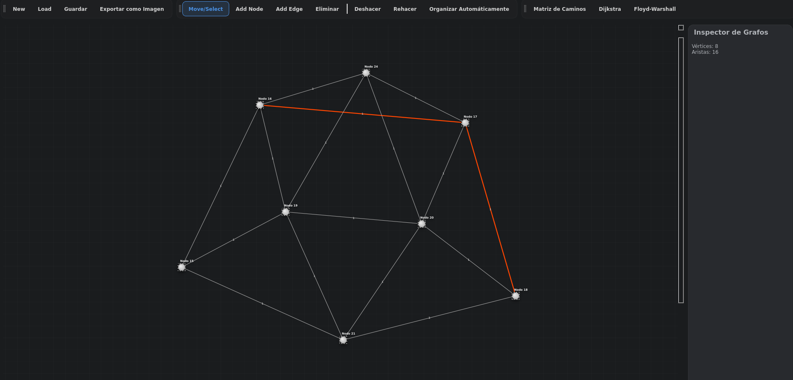

# Visualizador de Grafos GUI App

[](https://github.com/Geovanni-Gonzalez/VisualizadorDeGrafos-GUI-App/actions/workflows/ci.yml)

## Descripción
Aplicación C++ para visualizar grafos con componentes de interfaz, estructuras propias, algoritmos y CMake.

## Objetivo
Practicar estructuras de datos, algoritmos de grafos y aplicación gráfica en C++.

## Caso de estudio

### Problema
Analizar grafos solo desde archivos o consola dificulta entender relaciones, pesos y resultados de algoritmos. Una interfaz grafica permite construir escenarios, inspeccionar conexiones y comprobar visualmente operaciones sobre el grafo.

### Solución
La aplicacion combina un modelo de grafo en C++ con una interfaz Qt. El usuario puede cargar, editar y visualizar grafos mientras la logica de algoritmos se mantiene separada de la capa grafica.

### Arquitectura
- `include/`: contratos de clases, estructuras y componentes Qt.
- `src/`: implementacion del modelo, controladores, vista y algoritmos.
- `tests/`: verificacion de logica independiente de la interfaz.
- `CMakeLists.txt`: build reproducible para Qt/C++.

### Decisiones técnicas destacadas
- Separacion entre modelo de grafo, algoritmos y widgets Qt.
- CMake para compilar de forma consistente en local y GitHub Actions.
- Prueba `VerifyLogic.cpp` para validar comportamiento sin depender de la GUI.
- Limpieza de artefactos generados para mantener el repositorio legible.

## Tecnologías utilizadas
- C++
- CMake
- Grafos
- Estructuras de datos
- Qt5 Widgets/Core/Gui

## Funcionalidades principales
- Modelo de grafo
- Algoritmos separados
- Controlador de archivos
- Lista enlazada
- Prueba VerifyLogic.cpp

## Mi rol
Desarrollé estructuras, algoritmos y componentes de visualización.

## Aprendizajes clave
- Grafos C++
- include/src
- CMake
- Pruebas de lógica

## Instalación y ejecución
```bash
cd VisualizadorDeGrafos-GUI-App
cmake -S . -B build
cmake --build build
```
Luego ejecutar el binario generado en `build/`.

## Estructura del proyecto
- src/: implementaciones
- include/: headers
- tests/: prueba
- CMakeLists.txt: build

## Capturas o demo


## Estado del proyecto
Proyecto académico funcional/en desarrollo.

## Valor técnico demostrado
Muestra C++ estructurado, algoritmos de grafos y build reproducible.

## Mejoras futuras
- Agregar guía de instalación de Qt5 por sistema operativo
- Agregar ejemplos de grafo
- Ampliar pruebas

## Autor
Geovanni González  
Estudiante de Ingeniería en Computación  
GitHub: [Geovanni-Gonzalez](https://github.com/Geovanni-Gonzalez)


